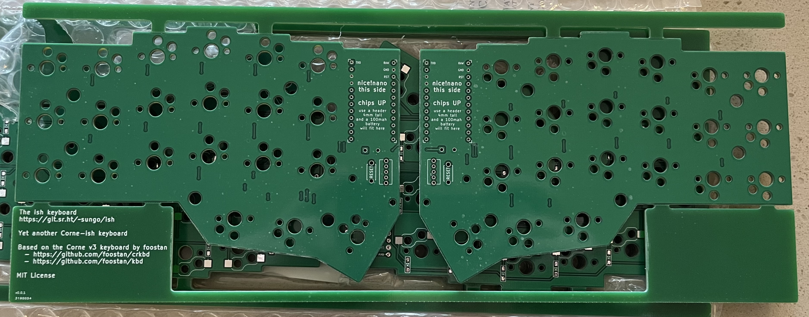
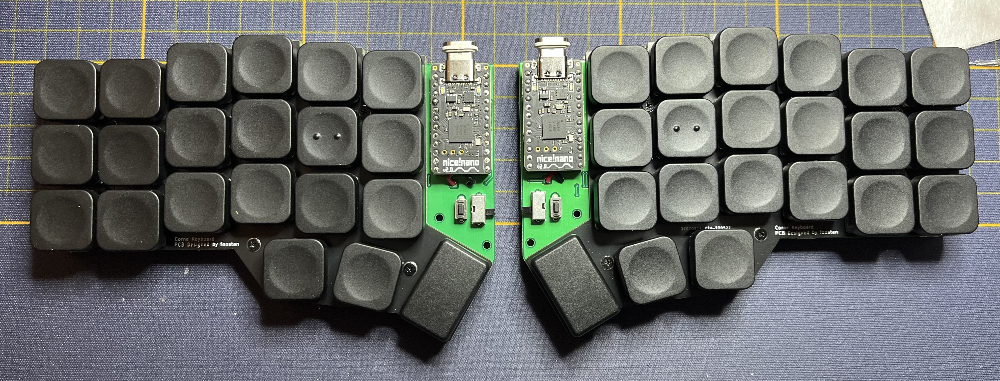

# ish

The ish, yet another Corne-ish keyboard

# Why?

Well, gotta learn kicad somehow and the Corne is one of my favorite boards. Like all keyboard people though, I have capital-T Thoughts about the Corne so why not learn kicad by tweaking the Corne.

To be clear before we get started, this is a Choc only build that is specifically designed for the [nice!nano](https://nicekeyboards.com/nice-nano) and [ZMK](https://zmk.dev) (Technically you can slot an Elite-C or something into the PCB but the battery and lack of connectivity between the halves makes that a silly thing to do.)

Also to be clear, this is built with me, sungo, in mind. I will be super thrilled if other folks like it but this board is to make me happy and serve as a learning experience.

# v0.0.1

The first build is back from the manufacturers and I have thoughts. See [the build notes](docs/v0.0.1.md) for more info. But tl;dr: the v0.0.1 tag is perfectly serviceable but the battery hookup is slightly obnoxious. But it all works fine. I do suggest the corne v2 key switch plate, entirely because it’s built for Choc. The v3 plates work but are super tight getting the switches in.

A v0.1.0 design is underway.

## BOM

TBD

# Goals

* a choc build based on the Corne v3 platform. The v3 simplified the board a great deal, particularly by making it not reversible. 
* Wireless first. Built specifically for the nice!nano, the ish comes with battery wiring and a power switch
* Fuck LEDs. I don't use LEDs or OLEDs on my battery builds so they're gone
* All going well, don't change anything that would break compatibility with the Corne v3 plates

# Design Principles

AKA arbitrary rules I made up for myself

* Fuck branding. If you've ever read Pattern Recognition by William Gibson, I have a branding allergy similar to Cayce Pollard. I _hate_ that most keyboards come slathered in URLs, cute logos, names, etc. 
* Limit the amount of traces on the top surface
* Put no traces on the top surface under the MCU (It's way too easy to crap up a board by cutting traces while trying to get a stuck hotswap MCU off the board)
* Limit soldering to one side
* Keep solder points and electronics away from the edges
* On an individual board, diodes all go the same direction

## How did things turn out?

### Branding

I put a bunch of text and links on the panelization. The board itself has a version number real small on the back under the MCU. The panelization text lets me convey the who and what and the version lets you know which board version you're holding in case it matters for the build guide. Otherwise, there are no brand markers on the finished board and there is no text visible on the top of the board once the MCU is in place.

### Trace Limits

There are very few traces on the top, just a few I needed to jump over traces that can't be moved. There is one trace on the top of left hand board that is the least complicated route for the reset line. I'd like to find another route for that but the other options are crazy complicated.

There are a lot of traces on the ish, by necessity, and keeping them all to the back led to a very crowded board. I did my best to limit the risk of crapping up traces on the back during the build but the area around the MCU is so tight that things aren't perfect. 

### Soldering Limits

There are no solder points on the top of the board. All the holes are masked off as well to keep anyone from getting a funny idea. 

Keeping solder points and pads away from the edge led to a complication discussed below, needing the switches to be in different orientations on the separate halves.

All diodes do in fact go the same direction on each half.

# Questions

## Why is the nice!nano face up?

Battery placement, plain and simple. If the nice!nano is chips-up, a 100mah battery fits perfectly under the MCU with a 4mm header easily obtained from Amazon. If the nice!nano is chips down, it does not.

## Why are the switches reversed on one half?

This is the result of a few of the design principles. The Corne v2 and the Corne v3 end up putting diodes and solder pads on the edge of the board on one half because there's no where else for them to go. On the other side, one direction conflicts with the standoff annular ring placement.  So, if I want to keep the diodes and pads away from the board edge and I don't want to move the annular rings, one half of the board must have switches that go the other direction. If I toss my rule against breaking v3 plate compatibility, I'll revisit this.

# License

The original Corne is licensed under the MIT license so the ish is as well.

- - -

Copyright © 2022 sungo

Corne v3, kbd library © 2019-2022 foostan

Permission is hereby granted, free of charge, to any person obtaining a copy of this software and associated documentation files (the “Software”), to deal in the Software without restriction, including without limitation the rights to use, copy, modify, merge, publish, distribute, sublicense, and/or sell copies of the Software, and to permit persons to whom the Software is furnished to do so, subject to the following conditions:

The above copyright notice and this permission notice shall be included in all copies or substantial portions of the Software.

THE SOFTWARE IS PROVIDED “AS IS”, WITHOUT WARRANTY OF ANY KIND, EXPRESS OR IMPLIED, INCLUDING BUT NOT LIMITED TO THE WARRANTIES OF MERCHANTABILITY, FITNESS FOR A PARTICULAR PURPOSE AND NONINFRINGEMENT. IN NO EVENT SHALL THE AUTHORS OR COPYRIGHT HOLDERS BE LIABLE FOR ANY CLAIM, DAMAGES OR OTHER LIABILITY, WHETHER IN AN ACTION OF CONTRACT, TORT OR OTHERWISE, ARISING FROM, OUT OF OR IN CONNECTION WITH THE SOFTWARE OR THE USE OR OTHER DEALINGS IN THE SOFTWARE.