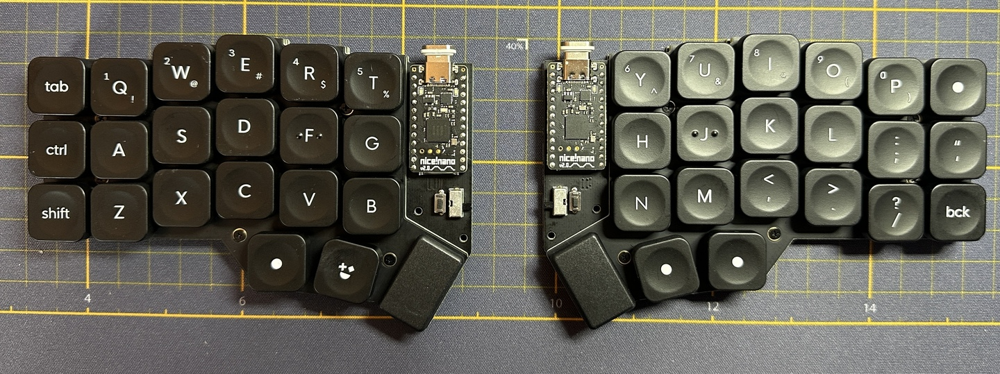
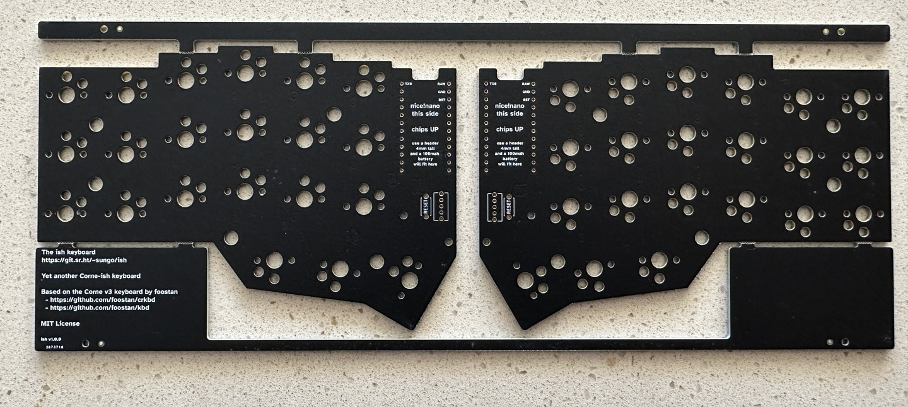
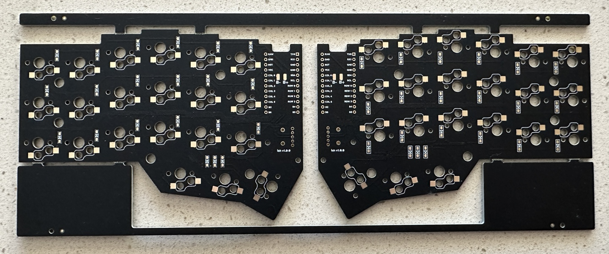

# ish

The ish, yet another Corne-ish keyboard

# What

The ish is a Corne-ish split 42-key keyboard, specifically designed for the [nice!nano](https://nicekeyboards.com/nice-nano), bluetooth/battery operation, and [ZMK](https://zmk.dev).

The ish has the following features/anti-features:

- Support for _both_ Choc v1 and Cherry MX switches, which can be used at the
  same time
- Keys are Cherry MX spaced (I have fat fingers)
- Designed for battery and bluetooth, via the nice!nano controller
- Does _not_ have LEDs, underglow or otherwise, nor OLED displays
- Relatively easy to build
- Based on the Corne v3

As of v1.1, the ish is known to work with a regular non-LED non-display Corne
profile using KMK and ZMK, including as a wired split. It has been tested with
nice!nano v2 and Adafruit Kee-boar controller.

## Controller Warning

If you want to use something other than a nice!nano, do _not_ connect the
battery. I'm not aware of another pro micro compat controller, other than the
nice!nano, with battery circuitry. You will most likely fry any other controller
and probably damage the battery and maybe cause a fire. 

# Why

Well, gotta learn kicad somehow and the Corne is one of my favorite boards. Like all keyboard people though, I have capital-T Thoughts about the Corne so why not learn kicad by tweaking the Corne.

Also to be clear, this is built with me, sungo, in mind. I will be super thrilled if other folks like it but this board is to make me happy and serve as a learning experience.

## Just give me the gerbers, dammit

The gerbers for the v1.0 are available [here](gerbers/ish-1.0.0-gerbers.zip). Top and bottom plates [are available](gerbers/) as well though regular Corne plates work just fine if you have those already.

Gerbers for v1.1 are coming soon

# Goals

* a choc build based on the Corne v3 platform. The v3 simplified the board a great deal, particularly by making it not reversible.
* Wireless first. Built specifically for the nice!nano, the ish comes with battery wiring and a power switch
* Fuck LEDs. I don't use LEDs or OLEDs on my battery builds so they're gone
* All going well, don't change anything that would break compatibility with the Corne v3 plates

# Design Principles

AKA arbitrary rules I made up for myself

* Fuck branding. If you've ever read Pattern Recognition by William Gibson, I have a branding allergy similar to Cayce Pollard. I _hate_ that most keyboards come slathered in URLs, cute logos, names, etc. 
* Limit the amount of traces on the top surface
* Put no traces on the top surface under the MCU (It's way too easy to crap up a board by cutting traces while trying to get a stuck hotswap MCU off the board)
* Limit soldering to one side
* Keep solder points and electronics away from the edges
* On an individual board, diodes all go the same direction

# Questions

## Why is the controller face up?

Battery placement, plain and simple. If the nice!nano is chips-up, a 100mah battery fits perfectly under the MCU with a 4mm header easily obtained from Amazon. If the nice!nano is chips down, it does not.

## Why are the switches reversed on one half?

This is the result of a few of the design principles. The Corne v2 and the Corne v3 end up putting diodes and solder pads on the edge of the board on one half because there's no where else for them to go. On the other side, one direction conflicts with the standoff annular ring placement.  So, if I want to keep the diodes and pads away from the board edge and I don't want to move the annular rings, one half of the board must have switches that go the other direction. If I toss my rule against breaking v3 plate compatibility, I'll revisit this.

# BOM

## Required parts that the board was designed around

These parts were specifically used in the design process. If you find other working options, please let me know.

- [Two nice!nano controllers](https://nicekeyboards.com/nice-nano/) soldered with machine pins
- [Two slide switches](https://www.digikey.com/en/products/detail/te-connectivity-alcoswitch-switches/1825232-1/4021554)
- [Two lithpoly batteries _with protection circuits_](https://www.digikey.com/en/products/detail/adafruit-industries-llc/1570/5054546) - the protection circuits are really important as the ish has no onboard battery management of its own
- [Two JST connectors](https://www.aliexpress.us/item/2255799843407025.html)

## Other bits and bobs

- [Two momentary reset switches](https://www.digikey.com/en/products/detail/c-k/PTS636-SM43-LFS/10071715)
- [42 diodes](https://www.digikey.com/en/products/detail/comchip-technology/CDSW4148-G/3308608)
- [Machine pin headers](https://www.amazon.com/gp/product/B0187LTEX2/) that, once installed, are at least 4mm tall to fit the battery
- 42 Choc v1 switches and caps / 42 MX switches and caps; chef's choice

# License

The original Corne is licensed under the MIT license so the ish is as well.

- - -

Copyright © 2022-2023 sungo

Corne v3, kbd library © 2019-2022 foostan

Permission is hereby granted, free of charge, to any person obtaining a copy of this software and associated documentation files (the “Software”), to deal in the Software without restriction, including without limitation the rights to use, copy, modify, merge, publish, distribute, sublicense, and/or sell copies of the Software, and to permit persons to whom the Software is furnished to do so, subject to the following conditions:

The above copyright notice and this permission notice shall be included in all copies or substantial portions of the Software.

THE SOFTWARE IS PROVIDED “AS IS”, WITHOUT WARRANTY OF ANY KIND, EXPRESS OR IMPLIED, INCLUDING BUT NOT LIMITED TO THE WARRANTIES OF MERCHANTABILITY, FITNESS FOR A PARTICULAR PURPOSE AND NONINFRINGEMENT. IN NO EVENT SHALL THE AUTHORS OR COPYRIGHT HOLDERS BE LIABLE FOR ANY CLAIM, DAMAGES OR OTHER LIABILITY, WHETHER IN AN ACTION OF CONTRACT, TORT OR OTHERWISE, ARISING FROM, OUT OF OR IN CONNECTION WITH THE SOFTWARE OR THE USE OR OTHER DEALINGS IN THE SOFTWARE.
