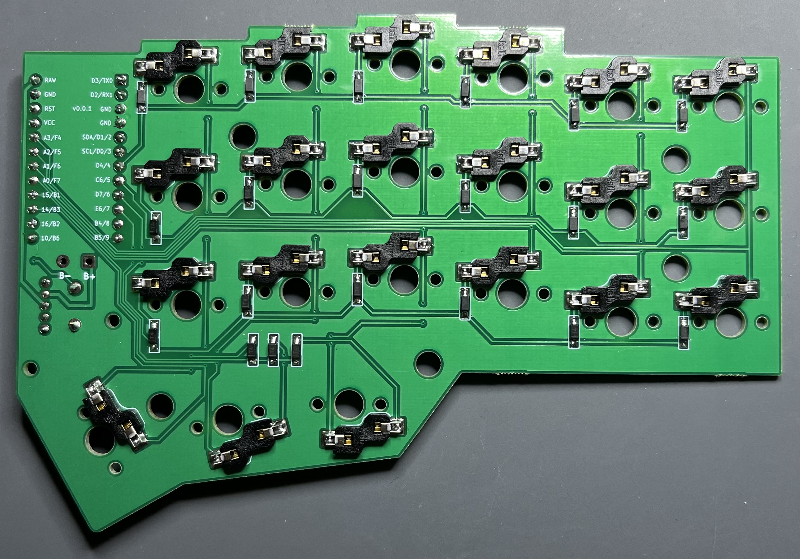
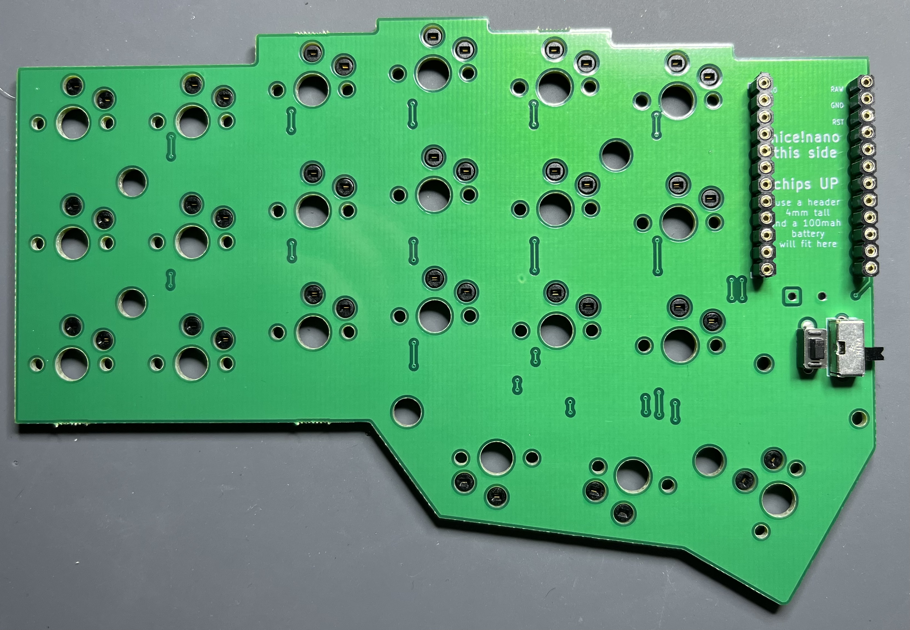

# v0.0.1 Build Notes

General summary is that the PCB came out really well with no fuss from allpcb. Prices were comparable to jlcpb and allpcb gave me no shit and didn’t tack on weird fees. Going forward, I’ll use allpcb as my vendor of choice.

Everything works. The battery hookup is not my favorite.

## Photos

# The Good

Everything works.

The power switch was an excellent choice. The solder points are a little close together for my tastes but a little bit of careful patience and the switch works great.

The reset switch is fine and I like its placement next to the power switch.

All text on the top is hidden by the electronics with the exception of the little square corners around the MCU headers.

The headers I’m using for the MCU are a lot more forgiving than the low profile I usually use.

The battery fits perfectly.

While a little weird during the build, the flipped switch sockets work just fine. Just one of those things that will have to be discussed loudly in the eventual build guide.

# The Bad

The diodes would benefit from being moved a bit further away from the switch pads. There’s not really wrong with their placement now but a bit more room would make it an easier build. There’s plenty of the space on the back to move the diodes around.

I really dislike the battery hookup. It’s too close to the battery and it’s really fiddly. Have to strip the wires almost up next to the battery and then figure out how to get both wires through the holes without them touching. If the wires are too big for the hole, the bare metal ends up exposed a bit up top. The solder mask over the pads prevent filling things with solder from the top too. Playing around with this a bit in kicad, I don’t think the arrangement is salvageable. There’s just not enough room. If I was ok with running traces between the header pegs, I could find some room probably but I’m not comfortable with that.

# Todo for next build

## Physical

* Move the diodes a little further away from the switch pads
* Redesign the battery hookup
    * Remove the power traces from the top of the board
* Remove the ground plane from the back. This is sort of cosmetic. The board doesn’t need a ground plane on both halves and to let the plane fill the back, I have to move the vias further away from the traces. This leads to longer traces up top. Also, for way later, osh park has a fun “after dark” option that is black substrate with clear solder mask. Removing the ground plane from the back will expose the traces really nicely.

## Cosmetic

* Remove the silkscreen corners around the MCU
* Update the silkscreen for the MCU pins to show rows and columns

## For Fun

* maybe play around with melting the traces